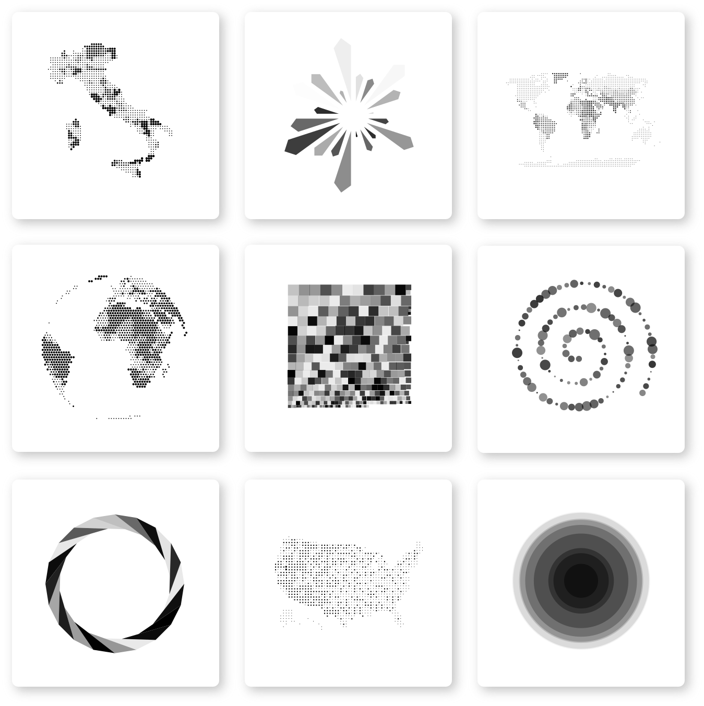

<p align="center">
  
</p>

---

[](https://www.npmjs.com/org/datalith)
[](https://www.npmjs.com/org/datalith)

### **Datalith** is a collection of clean, lightweight and easily customizable React components for data visualization.

The purpose is to provide an easy way to integrate custom data visualizations in any React
project. The components were designed with simplicity in mind, so the only thing required
for the charts to work is the actual _data_.

Some key features:

- Typed React components for optimal DX
- Simple, shared API
- Easy to integrate, customize, and enhance

---

<a href="https://docs.datalith.xyz">
  
</a>

---

## Installation

```sh
yarn add @datalith/shutter @datalith/hexmap @datalith/ripple
```

To install all modules as a single package:

```sh
yarn add datalith
```

Then in you React app:

```tsx
import React from 'react'
import ReactDOM from 'react-dom'
import { HexMap } from '@datalith/hexmap'

ReactDOM.render(
  <HexMap
    data={data}
    coords={d => [d.lng, d.lat]}
    value={d => d.value}
    side={5}
    featureCollection={featureCollection}
    projection={geoProjection}
  />,
  document.getElementById('root'),
)
```

## Development

### Getting Started

```bash
$ yarn
$ yarn bootstrap
```

### Start dev environment (Storybook)

```bash
$ yarn start
```

### Build for production

```bash
$ yarn build
```

## F.A.Q.

- Axis, labels or legends are not included, what if I need those?

  > The purpose of the project is to provide an easy way to display data in a very straightforward and engaging way, so the focus of _datalith_ is on the shapes and the visual patterns, and that's why axis, labels or legends are not included by default. However, if you need to display them, you can easily create your own components (or use a library like [vx](https://github.com/hshoff/vx)) and include those elements as an additional layer by passing them to the `additionalElements` prop.

- I need a simple [barchart | scatterplot | piechart | ... ], why is it missing?

  > _datalith_ differs from other data-viz libraries by providing unconventional yet clear and easy-to-read data visualizations, that's why you won't find barcharts or piecharts, there are already a lot of libraries which let you create basic charts like those. This also means ideas about new unique visual models are strongly welcomed, feel free to open an issue to discuss ;)

- Which packages do I have to use?

  > _datalith_ is meant to be extremely modular, so you can install only the charts you need by using the scoped package install:

  > ```sh
  > yarn add @datalith/hexmap
  > ```

  > Optionally, you can also choose to insall the complete collection of charts:

  > ```sh
  > yarn add datalith
  > ```

- What about animations/transitions?

  > As the charts are rendered using SVG, you can use any react animation library you prefer, I suggest [react-spring](https://github.com/react-spring/react-spring), which is the one used in the examples, but there are many other great alternatives as well.

- Does it come with types?

  > Yes it does.

#### The project is still at an early stage
